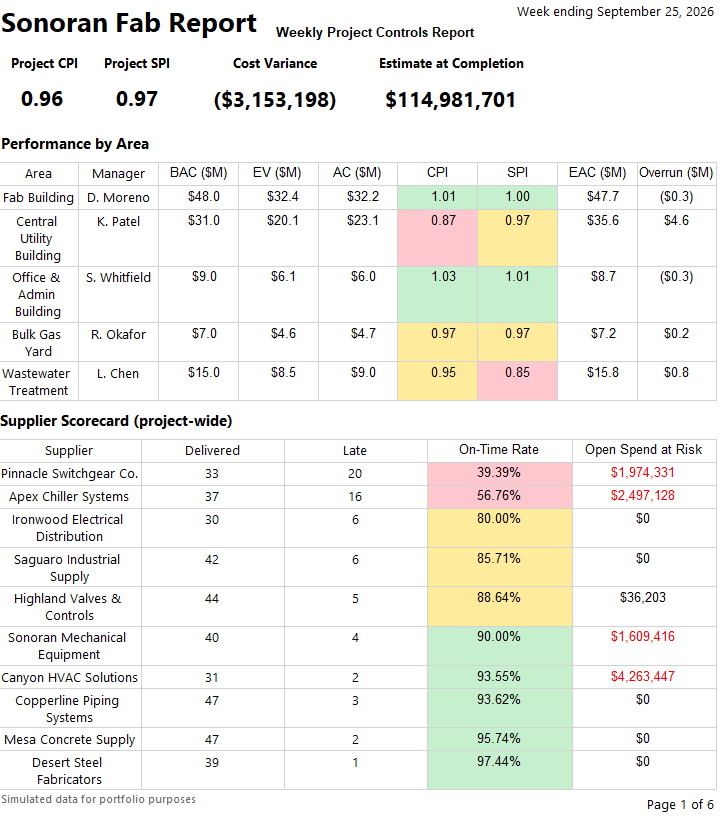
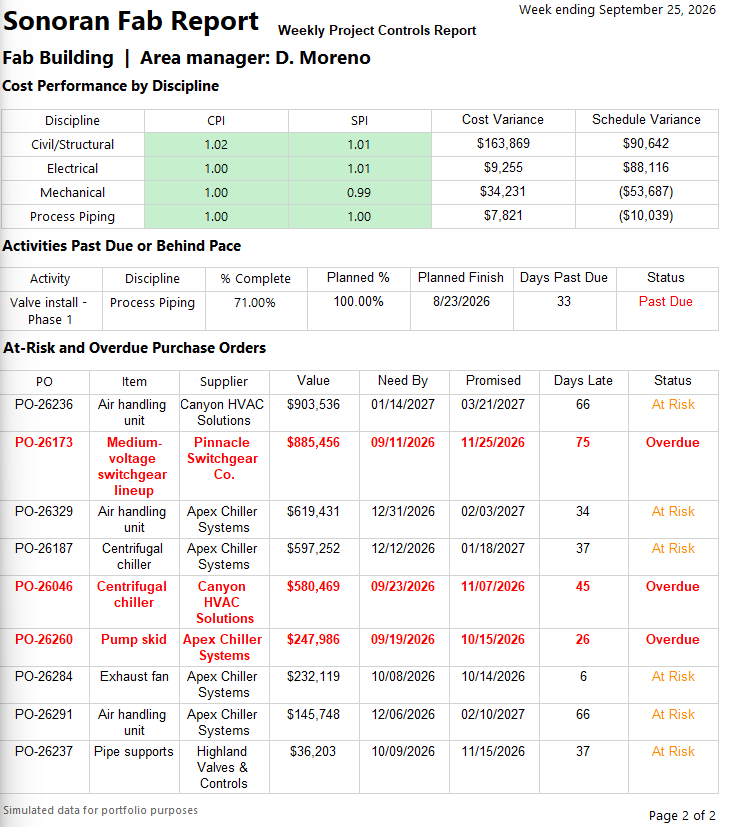

# Sonoran Fab Project Controls Report

A weekly project controls report for a simulated semiconductor fabrication facility under construction in Chandler, Arizona. The report tracks cost performance, schedule progress, and supplier delivery risk across five areas of the site, and produces a print-ready PDF with one page per area.

Built with **SQL Server**, **Power BI Report Builder** (paginated reports), and **Python**.

> All data in this project is simulated. The project, suppliers, and people are fictional.



---

## The business problem

On a large construction project, the project manager and area managers need a weekly status report that answers three questions:

1. **Cost:** Is each area spending money efficiently for the work it has completed?
2. **Schedule:** Which activities are behind, and where?
3. **Procurement:** Which equipment and materials are arriving late, or will arrive late, and from which suppliers?

This report answers all three on a single summary page, followed by a detailed page for each area of the site.

---

## Key findings

**Overall status:** The project is tracking slightly behind the planned schedule, with a CPI of 0.96 and an SPI of 0.97. We are getting about 96 cents of completed work for every dollar that is spent, and we are about 3% behind schedule. Those overall numbers hide two areas that need our attention.

**Cost:** The biggest cost problem is the Central Utility Building. Its CPI of 0.87 means that it is projected to finish about $4.6 million over the original $31 million budget. The overspending is spread across all 4 disciplines, with CPIs between 0.86 and 0.88, which points to an area-wide cause such as the original estimate, site conditions, or labor productivity, rather than just a single subcontractor.

**Schedule:** Wastewater Treatment is the furthest behind, with an SPI of 0.85 and 11 activities that are past due, compared to the other areas that have 1 to 4 past-due activities each. Wastewater Treatment is close to budget, which means this is a schedule problem rather than a spending one.

**Procurement:** Apex Chiller Systems and Pinnacle Switchgear have the worst delivery records at 57% and 39% on-time rates. Our largest current risk, though, is Canyon HVAC, with about $4.3 million in orders promised after their need-by dates, despite a 94% on-time history. Four orders are already overdue. The most urgent is the Fab Building's medium-voltage switchgear from Pinnacle (PO-26173), which was needed September 11 and isn't promised until late November.

**Recommendations:**
- Hold a cost review with the Central Utility Building's area manager to find the cause of the area-wide overrun before it grows.
- Meet with the Wastewater Treatment team on a recovery schedule for the 11 past-due activities.
- Escalate PO-26173 with Pinnacle this week, and confirm delivery dates with Canyon HVAC on its $4.3 million in at-risk equipment.

The full written summary is in [`Report Summary`](report/Weekly_Project_Controls_Summary.pdf).

---

## The report



**Page 1: Project summary**
- Headline KPIs: project CPI, SPI, cost variance, and estimate at completion
- Performance by area, with CPI and SPI color-coded green, amber, and red
- Supplier scorecard showing on-time delivery rate and open spend at risk

**One page per area**
- Cost performance by discipline
- Activities that are past due or behind pace
- Purchase orders that are at risk or overdue, sorted by value

**Report features:** Area (multi-select) and Week Ending parameters, grouped page breaks, conditional formatting, repeating table headers, and PDF export.

The exported report is in [`Full Report File`](Report/SonoranFab_Weekly_Report.pdf).

---

## How it works

### Data
Five tables of simulated project data, generated with Python (`generate_data.py`):

| Table | Rows | Contents |
|---|---|---|
| `areas` | 5 | The five areas of the site and their managers |
| `suppliers` | 10 | Equipment and material suppliers |
| `purchase_orders` | 450 | Orders with need-by, promised, and delivery dates |
| `schedule_activities` | 207 | Construction activities with planned dates and percent complete |
| `weekly_cost` | 1,040 | Weekly cumulative earned value data by area and discipline |

### SQL views
The business logic lives in SQL Server views, so the report only has to display results.

| View | Purpose |
|---|---|
| `vw_procurement_status` | Flags each PO as Delivered On Time, Delivered Late, At Risk, Overdue, On Track, or Cancelled |
| `vw_supplier_scorecard` | Calculates each supplier's on-time rate and open spend at risk |
| `vw_schedule_status` | Flags activities as Complete, Past Due, Behind Pace, On Track, or Not Started |
| `vw_cost_performance_weekly` | Calculates CPI, SPI, cost and schedule variance, and EAC by area and discipline |
| `vw_area_performance_weekly` | Rolls the earned value metrics up to the area level |
| `vw_area_report_detail` | Combines cost, activity, and PO rows into one dataset for the per-area pages |

### Earned value metrics

| Metric | Formula | Meaning |
|---|---|---|
| CPI | EV ÷ AC | Below 1.0 means over budget for the work completed |
| SPI | EV ÷ PV | Below 1.0 means behind schedule |
| Cost variance | EV − AC | Negative means over budget, in dollars |
| EAC | BAC ÷ CPI | Projected total cost if current efficiency continues |

---

## Running it yourself

**Requirements (all free, Windows only):** SQL Server Express, SQL Server Management Studio (SSMS), and Power BI Report Builder.

1. Download or clone this repository.
2. Open `sql/SonoranFab_Full_Setup.sql` in SSMS. Use Find and Replace to change the file path in the `BULK INSERT` lines to the location of the `data` folder on your computer.
3. Connect to your SQL Server instance (for example, `localhost\SQLEXPRESS`) and run the script. It creates the database, loads the data, and builds all the views.
4. Open `report/SonoranFab_Weekly_Report.rdl` in Power BI Report Builder. If needed, update the data source connection string to match your server:
   ```
   Data Source=localhost\SQLEXPRESS;Initial Catalog=SonoranFabControls;Integrated Security=True;TrustServerCertificate=True
   ```
5. Click **Run**.

---

## Known limitations

- **The activity and purchase order sections reflect the current status date only.** Changing the Week Ending parameter updates the cost metrics, but the PO and activity data is a single snapshot. With real data, storing weekly snapshots of PO status would let the report show the project at any past date.
- **Planned progress assumes work is spread evenly** between each activity's planned start and finish. Real schedules often follow a resource-loaded curve.
- **The data is simulated,** so the patterns in it were designed to be found. Real project data would need more cleaning and validation.

---

## Repository structure

```
sonoran-fab-project-controls/
├── README.md
├── generate_data.py
├── data/          Five CSV files of simulated project data
├── sql/           Table creation, data loading, and reporting views
├── report/        Report Builder file, PDF export, and findings summary
└── screenshots/   Images used in this README
```

---

## About

Built by **Nikolas Zeiner**, a business analytics graduate (M.S. and B.S., Grand Canyon University) based in the Phoenix area.

Portfolio: [nikolaszeiner.github.io/NikolasZeiner](https://nikolaszeiner.github.io/NikolasZeiner)
